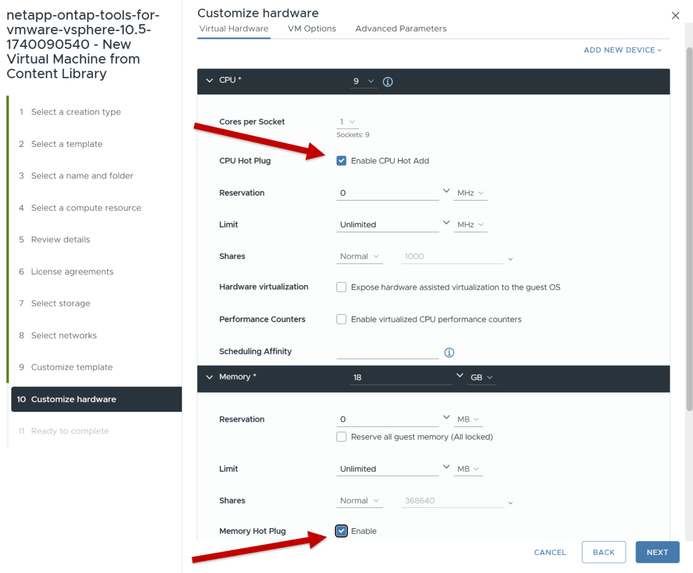

= ONTAP tools 배포
:allow-uri-read: 
:icons: font
:imagesdir: ../media/

[role="lead"]
ONTAP tools for VMware vSphere NFS 및 VMFS 데이터 저장소를 지원하는 핵심 서비스와 함께 소규모 단일 노드로 배포됩니다. ONTAP 도구 배포 프로세스는 최대 45분이 소요될 수 있습니다.

.시작하기 전에
작은 단일 노드를 배포하는 경우 콘텐츠 라이브러리는 선택 사항입니다.  다중 노드 또는 HA 배포의 경우 콘텐츠 라이브러리가 필요합니다.  VMware에서는 콘텐츠 라이브러리에 VM 템플릿, vApp 템플릿 및 기타 파일이 저장됩니다.  콘텐츠 라이브러리를 사용하여 배포하면 네트워크 연결에 의존하지 않으므로 원활한 환경을 제공합니다.

콘텐츠 라이브러리를 만들기 전에 다음 사항을 고려하세요.

* 클러스터의 모든 호스트가 액세스할 수 있도록 공유 데이터 저장소에 콘텐츠 라이브러리를 만듭니다.
* ONTAP tools for VMware vSphere 배포하기 전에 콘텐츠 라이브러리를 설정합니다.
* HA를 위해 어플라이언스를 구성하기 전에 콘텐츠 라이브러리가 생성되었는지 확인하세요.
+

NOTE: 배포 후에는 콘텐츠 라이브러리에서 OVA 템플릿을 삭제하지 마세요.

NOTE: 향후 HA 배포를 활성화하려면 ONTAP 도구 가상 머신을 ESXi 호스트에 직접 배포하지 마세요.  대신 ESXi 호스트 클러스터나 리소스 풀에 배포하세요.

콘텐츠 라이브러리를 만들려면 다음 단계를 따르세요.

. ONTAP tools for VMware vSphere 의 바이너리(_.ova_)와 서명된 인증서가 포함된 파일을 다운로드하세요.  https://mysupport.netapp.com/site/products/all/details/otv10/downloads-tab["NetApp Support 사이트"^] .
. vSphere Client에 로그인합니다
. vSphere Client 메뉴를 선택하고 * Content libraries * 를 선택합니다.
. 페이지 오른쪽에서 * 만들기 * 를 선택합니다.
. 라이브러리 이름을 지정하고 콘텐츠 라이브러리를 만듭니다.
. 생성한 콘텐츠 라이브러리로 이동합니다.
. 페이지 오른쪽의 * Actions * 를 선택하고 * Import item * 을 선택한 후 OVA 파일을 가져옵니다.

NOTE: 자세한 내용은 https://blogs.vmware.com/vsphere/2020/01/creating-and-using-content-library.html["콘텐츠 라이브러리 만들기 및 사용"] 블로그 를 참조하십시오.

NOTE: 배포를 진행하기 전에 인벤토리의 클러스터 분산 리소스 스케줄러(DRS)를 '보수적'으로 설정합니다.  이렇게 하면 설치 중에 VM이 마이그레이션되지 않습니다.

ONTAP tools for VMware vSphere 처음에는 비 HA 설정으로 배포됩니다.  HA 배포로 확장하려면 CPU 핫 플러그와 메모리 핫 플러그인을 활성화해야 합니다. 이 단계는 배포 프로세스의 일부로 수행하거나 배포 후 VM 설정을 편집할 수 있습니다.

.단계
. 에서 ONTAP tools for VMware vSphere에 대한 바이너리(_.ova_) 및 서명된 인증서가 포함된 파일을 다운로드합니다 https://mysupport.netapp.com/site/products/all/details/otv10/downloads-tab["NetApp Support 사이트"^] OVA를 콘텐츠 라이브러리로 가져온 경우 이 단계를 건너뛰고 다음 단계로 진행할 수 있습니다
. vSphere 서버에 로그인합니다.
. OVA를 배포하려는 리소스 풀, 클러스터 또는 호스트로 이동합니다.
+

NOTE: VMware vSphere 가상 머신용 ONTAP 툴을 관리하는 VVOL 데이터 저장소에 저장하지 마십시오.

. 콘텐츠 라이브러리 또는 로컬 시스템에서 OVA를 배포할 수 있습니다.
+
|===

| 로컬 시스템에서 | 콘텐츠 라이브러리에서 

| a. 마우스 오른쪽 단추를 클릭하고 * Deploy OVF template... *.b. URL에서 OVA 파일을 선택하거나 해당 위치를 찾은 후 * Next * 를 선택합니다. | a. 콘텐츠 라이브러리로 이동하여 배포할 라이브러리 항목을 선택합니다. b. * Actions * > * 이 템플릿에서 New VM * 을 선택합니다 
|===
. Select a name and folder * 필드에 가상 머신 이름을 입력하고 위치를 선택합니다.
+
** vCenter Server 8.0.3 버전을 사용하는 경우 * 이 가상 시스템의 하드웨어 사용자 정의 * 옵션을 선택합니다. 그러면 * 완료 준비 * 창으로 진행하기 전에 * 하드웨어 사용자 정의 * 라는 추가 단계가 활성화됩니다.
** vCenter Server 7.0.3 버전을 사용하는 경우 배포 마지막 부분의 *다음 단계는 무엇입니까?* 섹션의 단계를 따르세요.image:../media/select-name.png["이름과 폴더를 선택하세요"]

. 컴퓨터 리소스를 선택하고 * 다음 * 을 선택합니다. 필요에 따라 배포된 VM의 전원을 자동으로 켜려면 * 확인란을 선택합니다.
. 템플릿의 세부 정보를 검토하고 * 다음 * 을 선택합니다.
. 사용권 계약을 읽고 동의한 후 * Next * 를 선택합니다.
. 구성 및 디스크 형식에 대한 스토리지를 선택하고 * Next * 를 선택합니다.
. 각 소스 네트워크에 대한 대상 네트워크를 선택하고 * 다음 * 을 선택합니다.
. *템플릿 사용자 지정* 창에서 필수 필드를 입력합니다.image:../media/custom-temp.png["템플릿 사용자 정의"]
+

NOTE: vCenter 호스트 이름은 ONTAP 도구 어플라이언스가 배포된 vCenter Server 인스턴스의 이름입니다.

+
어플라이언스가 하나의 vCenter 인스턴스에서 호스팅되고 다른 인스턴스를 관리하는 2개의 vCenter Server 토폴로지에서 ONTAP 도구를 배포하는 경우 ONTAP 도구를 호스팅하는 vCenter 인스턴스에 제한된 역할을 할당할 수 있습니다. OVF 템플릿 배포에 필요한 권한만 가진 전용 vCenter 사용자 및 역할을 생성할 수 있습니다. 자세한 내용은 아래에 나열된 역할을 참조하십시오. https://review.docs.netapp.com/us-en/ontap-tools-vmware-vsphere-10_otv105-releasebranch/concepts/rbac-vcenter-use.html#vsphere-object-hierarchy["VMware vSphere 10용 ONTAP 툴에 포함된 역할"].

+
ONTAP 도구로 관리되는 vCenter 인스턴스의 경우 vCenter 사용자 계정에 관리자 권한이 있는지 확인하세요.

+
** 호스트 이름은 문자(A-Z, a-z), 숫자(0-9) 및 하이픈(-)을 포함해야 합니다. 이중 스택을 구성하려면 IPv6 주소에 매핑된 호스트 이름을 지정합니다.
+

NOTE: Pure IPv6는 지원되지 않습니다. 혼합 모드는 IPv6 및 IPv4 주소를 모두 포함하는 VLAN에서 지원됩니다.

** ONTAP 도구 IP 주소는 ONTAP 툴과의 통신을 위한 기본 인터페이스입니다.
** IPv4는 노드 구성의 IP 주소 구성 요소로, 디버깅 및 유지 관리를 위해 노드에서 진단 셸 및 SSH 액세스를 활성화하는 데 사용할 수 있습니다.

. vCenter Server 8.0.3 버전을 사용하는 경우, *하드웨어 사용자 지정* 창에서 *CPU 핫 추가* 및 *메모리 핫 플러그* 옵션을 활성화하여 HA 기능을 허용합니다.
. 완료 준비 * 창에서 세부 정보를 검토하고 * 마침 * 을 선택합니다.
+
구축 작업이 생성되면 vSphere 작업 표시줄에 진행 상황이 표시됩니다.

. 작업을 완료한 후 VM의 전원을 자동으로 켜는 옵션이 선택되지 않은 경우 VM의 전원을 켭니다.

VM의 웹 콘솔에서 설치 진행률을 추적할 수 있습니다.

OVF 양식에 불일치 사항이 있는 경우 대화 상자가 나타나 수정 조치를 취하도록 안내합니다.  탭 버튼을 사용하여 탐색하고, 필요한 변경 사항을 적용한 후 *확인*을 선택하세요.  문제를 해결하려면 세 번의 시도가 있습니다.  3번 시도 후에도 문제가 지속되면 설치 프로세스가 중지되므로 새 가상 머신에서 설치를 다시 시도하는 것이 좋습니다.

.다음 단계
vCenter Server 7.0.3과 함께 VMware vSphere용 ONTAP 툴을 배포한 경우 구축 후 다음 단계를 수행합니다.

. vCenter 클라이언트에 로그인합니다
. ONTAP 도구 노드의 전원을 끕니다.
. *인벤토리*에서 ONTAP tools for VMware vSphere 로 이동하여 *설정 편집* 옵션을 선택합니다.
. CPU * 옵션 아래에서 * Enable CPU hot add * 확인란을 선택합니다
. 메모리 * 옵션에서 * 메모리 핫 플러그 * 에 대해 * 활성화 * 확인란을 선택합니다.

