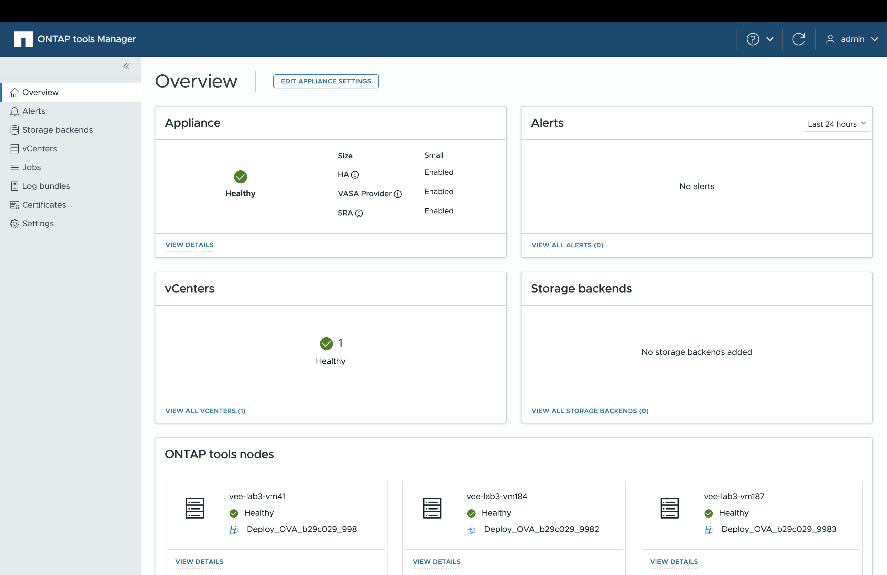

= ONTAP tools Manager 사용자 인터페이스에 대해 알아보십시오
:allow-uri-read: 
:icons: font
:imagesdir: ../media/

[role="lead"]
ONTAP tools for VMware vSphere 멀티 테넌시를 지원하여 여러 vCenter Server 인스턴스를 관리할 수 있습니다.

ONTAP 도구 관리자는 ONTAP tools for VMware vSphere 관리하기 위한 웹 기반 콘솔입니다.

ONTAP 도구 관리자는 다음과 같은 기능을 제공합니다.

* 알림 관리 - ONTAP tools for VMware vSphere 에서 생성된 알림을 보고 필터링합니다.
* 스토리지 백엔드 관리 - ONTAP 스토리지 클러스터를 추가하고 관리하며 이를 vCenter Server 인스턴스에 전역적으로 매핑합니다.
* vCenter Server 인스턴스 관리 - ONTAP 도구 내에서 vCenter Server 인스턴스를 추가하고 관리합니다.
* 작업 모니터링 - ONTAP 도구 플러그인 인터페이스와 ONTAP 도구 관리자 인터페이스에서 시작된 비동기 작업을 모니터링하고 디버깅합니다.  기간별로 작업을 필터링하고, 페이지 크기를 조정하고, 오류 및 하위 작업을 포함한 작업 세부 정보를 볼 수 있습니다.  실패 상태를 클릭하면 오류 세부 정보를 볼 수 있습니다.  하위 작업이 있는 작업의 경우 행을 확장하여 설명과 상태를 확인하세요.  하위 작업의 경우 작업의 드릴다운을 사용하여 세부 정보를 확인하세요.
* 로그 번들 다운로드 - ONTAP tools for VMware vSphere 문제를 해결하기 위한 로그 파일을 수집합니다.
* 인증서 관리 - 자체 서명 인증서를 사용자 정의 CA 인증서로 교체하고, VASA Provider 및 ONTAP 도구에 대한 인증서를 갱신하거나 새로 고칩니다.
* 비밀번호 재설정 - VASA 공급자와 SRA의 비밀번호를 변경합니다.
* 어플라이언스 설정 관리 - HA 활성화 및 노드 크기 확장을 포함하여 ONTAP 도구 어플라이언스를 구성합니다.

ONTAP Tools Manager에 액세스하려면 `\https://<ONTAPtoolsIP>:8443/virtualization/ui/` 브라우저에서 을 시작하고 구축 중에 제공한 VMware vSphere 관리자 자격 증명용 ONTAP 툴을 사용하여 로그인합니다.

|===
| * 카드 * | * 설명 * 

| 어플라이언스 카드 | 어플라이언스 카드는 ONTAP 도구 어플라이언스의 전반적인 상태, 구성 세부 정보 및 활성화된 서비스 상태를 보여줍니다.  자세한 내용을 보려면 *자세히 보기* 링크를 선택하세요.  기기 설정을 변경하면 변경이 완료될 때까지 카드에 작업 상태와 세부 정보가 표시됩니다. 

| 경고 카드 | 알림 카드는 HA 노드 수준 알림을 포함하여 유형별로 분류된 ONTAP 도구 알림을 보여줍니다.  알림 개수 하이퍼링크를 클릭하면 선택한 알림 유형별로 필터링된 알림 페이지로 이동하여 자세한 알림을 볼 수 있습니다. 

| vCenter 카드 | vCenter 카드는 ONTAP 도구에서 관리하는 모든 vCenter Server 인스턴스의 상태를 보여줍니다.  해당 링크를 선택하면 각 vCenter에 대한 세부 정보를 볼 수 있으며, 이 링크를 클릭하면 선택한 인스턴스에 대한 자세한 정보가 있는 페이지로 이동합니다. 

| 스토리지 백엔드 카드 | 스토리지 백엔드 카드는 ONTAP 도구에 구성된 모든 ONTAP 스토리지 클러스터의 상태와 연결 상태를 보여줍니다.  해당 링크를 선택하면 각 스토리지 백엔드에 대한 세부 정보를 볼 수 있으며, 선택한 클러스터에 대한 자세한 정보가 있는 페이지로 이동합니다. 

| ONTAP 도구 노드 카드 | ONTAP 도구 노드 카드는 노드 이름, VM 이름, 상태 및 네트워크 정보를 포함하여 어플라이언스의 모든 노드를 표시합니다.  특정 노드에 대한 자세한 내용을 보려면 *자세한 내용 보기*를 선택하세요.  [참고] HA가 아닌 구성에서는 단일 노드만 나타납니다.  HA 구성에서는 세 개의 노드가 표시됩니다. 
|===