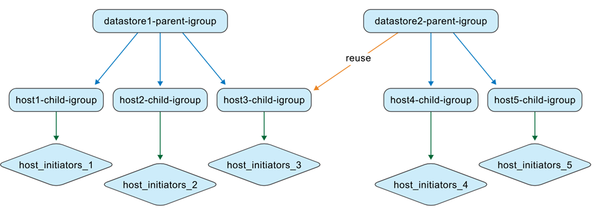
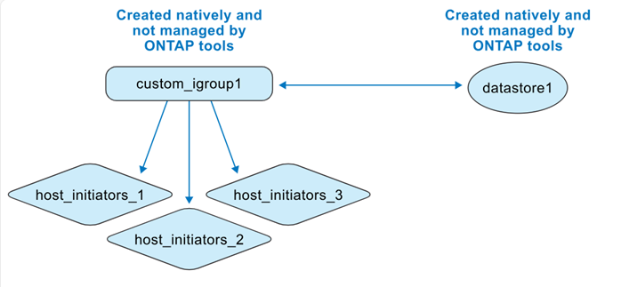

= ONTAP tools에서 igroup을 관리하는 방법
:allow-uri-read: 
:icons: font
:imagesdir: ../media/

[role="lead"]
ONTAP 도구 VM과 ONTAP 스토리지 시스템을 모두 관리하는 경우, 특히 ONTAP 도구로 관리되지 않는 환경에서 관리되는 환경으로 데이터스토어를 이동할 때 igroup의 동작 방식을 이해하는 것이 중요합니다. 이 페이지에서는 ONTAP tools for VMware vSphere가 igroup을 표현하고 관리하는 방식을 설명합니다. 이는 이전 릴리스와 현재의 중첩 igroup 모델 간의 동작 차이를 이해하기 위한 개념적인 정보입니다.

ONTAP tools for VMware vSphere 10.4부터 ONTAP tools는 ONTAP 및 vCenter 객체를 자동으로 생성하고 유지 관리하여 VMware 데이터 센터 환경에서 데이터 저장소 관리를 간소화합니다. ONTAP tools for VMware vSphere 10.5 P2부터는 마이그레이션된 igroup이 더 이상 사용되지 않을 경우 자동으로 삭제됩니다.

== 간략한 동작 요약

* ONTAP tools for VMware vSphere로 관리되는 VMFS 데이터 저장소는 중첩된 igroup을 사용합니다. 데이터 저장소 컨텍스트당 하나의 상위 igroup과 호스트당 하나의 하위 igroup이 있습니다.
* LUN 매핑은 하위 igroup에 적용됩니다.
* 사용자 지정 상위 igroup은 데이터 저장소 간에 재사용할 수 있습니다.
* ONTAP tools for VMware vSphere 9.x에서 마이그레이션된 igroup은 재사용할 수 없습니다.

== igroup 컨텍스트

ONTAP tools for VMware vSphere는 두 가지 컨텍스트에서 igroup을 처리합니다.

.ONTAP 도구가 아닌 관리되는 igroups
스토리지 관리자는 ONTAP 시스템에서 평면 또는 중첩 구조로 igroup을 생성할 수 있습니다. 다음 그림은 ONTAP에서 직접 생성된 평면 igroup을 보여줍니다.

image:../media/non-otv-managed.png["ONTAP 도구가 아닌 igroup 관리"]

.ONTAP 도구로 관리되는 igroups
데이터스토어를 생성할 때 ONTAP tools for VMware vSphere는 중첩 구조로 igroup을 생성합니다.

예를 들어, 호스트 1, 2, 3에 datastore1을 생성하여 마운트하고, 호스트 3, 4, 5에 새로운 datastore(datastore2)를 생성하여 마운트하는 경우 ONTAP 도구는 효율적인 관리를 위해 호스트 수준 igroup을 재사용합니다.

image:../media/otv-managed.png["ONTAP 도구 관리 igroup"]

== 명명 동작

데이터 저장소를 생성할 때 igroup 필드를 비워두면 ONTAP tools는 기본적으로 중첩된 igroup 구조를 생성합니다.

* 상위 igroup 명명 패턴: `otv_<vcguid>_<host_parent_datacenterMoref>_<datastore_name>`
* 하위 igroup 명명 패턴: `otv_<hostMoref>_<vcguid>`

ONTAP 시스템 인터페이스는 *상위 이니시에이터 그룹* 필드에서 상위 및 하위 igroup 간의 관계를 보여줍니다.

== 시나리오별 동작

[cols="25,25,25,25"]
|===
| 시나리오 | 상위 igroup 동작 | 하위 igroup 동작 | LUN 매핑 및 가시성 

| 기본 igroup 설정으로 생성된 데이터 저장소 | 기본 ONTAP tools 관리 상위 igroup이 생성됩니다. | 호스트 수준의 하위 igroup은 필요에 따라 생성됩니다. | LUN은 하위 igroup에 매핑됩니다. 데이터 저장소가 vCenter Server 인벤토리에 나타납니다. 

| 사용자 지정 igroup 이름으로 생성된 데이터 저장소 | 지정된 이름으로 사용자 지정 상위 igroup이 생성됩니다. | 호스트가 중복될 경우 기존 호스트 수준 하위 igroup이 재사용됩니다. | 새 데이터스토어 LUN이 재사용되거나 새로 생성된 하위 igroup에 매핑됩니다. 데이터스토어가 vCenter Server에 나타납니다. 

| 데이터 저장소 생성 중에 기존 사용자 지정 igroup이 재사용됩니다 | 기존의 사용자 지정 상위 igroup이 선택되어 재사용됩니다. | 하위 igroup은 호스트 멤버십에 따라 재사용되거나 확장됩니다. | 새 데이터스토어 LUN은 연결된 하위 igroup을 통해 매핑됩니다. 데이터스토어가 vCenter Server에 나타납니다. 

| 데이터스토어와 igroup은 ONTAP 및 vCenter에서 기본적으로 생성된 후 ONTAP tools에서 검색됩니다 | ONTAP tools는 관리 컨텍스트에 상위 igroup을 생성하고 원래 igroup 이름을 유지합니다. | ONTAP tools는 원래 igroup의 이름을  `otv_` 접두사로 변경하고 계층 구조에서 하위 igroup으로 나타냅니다. | 이니시에이터 매핑은 변경되지 않습니다. 검색 중에 데이터 저장소에 매핑된 igroup만 변환됩니다. 
|===

== 사용자 정의 igroup 재사용 및 API 동작

ONTAP tools for VMware vSphere 사용자 인터페이스에서 데이터 저장소를 생성하는 동안 드롭다운 목록에서 기존 사용자 지정 상위 igroup을 재사용할 수 있습니다.

API를 통해서도 동일한 동작이 지원됩니다. 데이터 저장소 생성 중에 기존 igroup을 재사용하려면 API 요청 페이로드에 igroup UUID를 제공하십시오.

NOTE: 사용자 정의 igroup만 재사용할 수 있습니다. ONTAP tools 9.x에서 마이그레이션된 igroup은 재사용할 수 없으며, ONTAP tools 10.5 P2부터는 더 이상 사용하지 않을 경우 자동으로 삭제됩니다.

== 네이티브에서 관리형으로의 전환 보기

ONTAP 시스템 및 VMware 환경에서 igroup과 데이터스토어를 직접 생성하는 경우, ONTAP tools는 초기에는 이러한 객체를 관리하지 않습니다. 따라서 igroup 구조가 평면적으로 생성됩니다.

데이터 저장소 검색 후 ONTAP tools는 데이터 저장소에 매핑된 igroup을 식별하고 등록한 다음 중첩 모델로 표현합니다. 상위 igroup은 데이터 저장소 수준에서 표현되고, 기존 igroup은 `otv_` 접두사가 붙은 하위 igroup으로 이름이 변경되며, 이니시에이터 매핑은 변경되지 않습니다.

image:../media/otv-ds.png["ONTAP 도구로 관리되는 데이터 저장소 및 igroup"]

ONTAP tools for VMware vSphere는 ONTAP 시스템에서 생성되었지만 데이터 저장소에 매핑되지 않았거나 ONTAP tools에 연결되지 않은 igroup을 감지하거나 관리하지 않습니다. 검색 중에 ONTAP tools는 검색된 데이터 저장소에 매핑된 igroup만 변환하며, 다른 igroup은 관리되지 않은 상태로 유지됩니다.

== 발견된 네이티브 igroup의 재사용

ONTAP tools for VMware vSphere가 검색된 네이티브 igroup을 관리한 후에는 해당 igroup이 데이터 저장소 생성을 위한 사용자 지정 이니시에이터 그룹 이름 드롭다운 목록에서 사용 가능해집니다.

새 데이터 저장소 LUN은 정규화된 하위 igroup에 매핑됩니다(예: `otv_NativeIgroup1`).

ONTAP tools for VMware vSphere는 ONTAP tools로 관리되지 않거나 데이터스토어에 연결되지 않은 ONTAP 시스템에서 생성된 igroup을 감지하거나 사용하지 않습니다.
