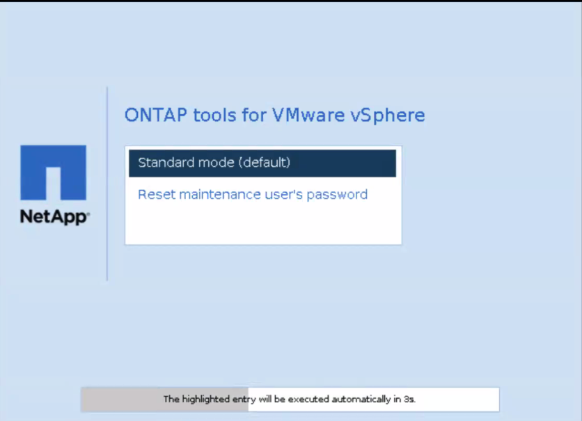

= ONTAP tools 유지 관리 콘솔 암호를 재설정합니다
:allow-uri-read: 
:icons: font
:imagesdir: ../media/

[role="lead"]
게스트 OS 재시작 작업 중에 GRUB 메뉴에 유지 관리 콘솔 사용자 암호를 재설정하는 옵션이 표시됩니다. 이 옵션을 사용하여 VM의 유지 관리 콘솔 사용자 암호를 업데이트하십시오. 암호를 재설정하면 VM이 재시작되어 새 암호가 설정됩니다. HA 배포 시나리오에서 VM이 재시작되면 나머지 두 VM의 암호도 자동으로 업데이트됩니다.

NOTE: ONTAP tools for VMware vSphere 의 경우 ONTAP 도구 관리 노드(node1)에서 유지 관리 콘솔 사용자 비밀번호를 변경해야 합니다.

.단계
. vCenter Server에 로그인합니다
. 가상 머신을 마우스 오른쪽 버튼으로 클릭하고 *전원* > *게스트 OS 다시 시작*을 선택합니다. 시스템이 다시 시작되면 다음 화면이 나타납니다: 
+
5초 이내에 옵션을 선택할 수 있습니다. 아무 키나 눌러 진행 과정을 중지하고 GRUB 메뉴를 고정합니다.

. 유지 관리 사용자 암호 재설정 * 옵션을 선택합니다. 유지 관리 콘솔이 열립니다.
. 콘솔에 새 비밀번호를 입력하고 확인하세요.  세 번의 시도 기회가 있습니다.  새로운 비밀번호를 성공적으로 입력하면 시스템이 다시 시작됩니다.
. 계속하려면 *Enter*를 누르세요.  시스템이 VM의 비밀번호를 업데이트합니다.

NOTE: 가상 머신을 켜면 동일한 GRUB 메뉴가 나타납니다. 하지만 암호 재설정 옵션은 *Restart Guest OS* 옵션과 함께 사용해야 합니다.
