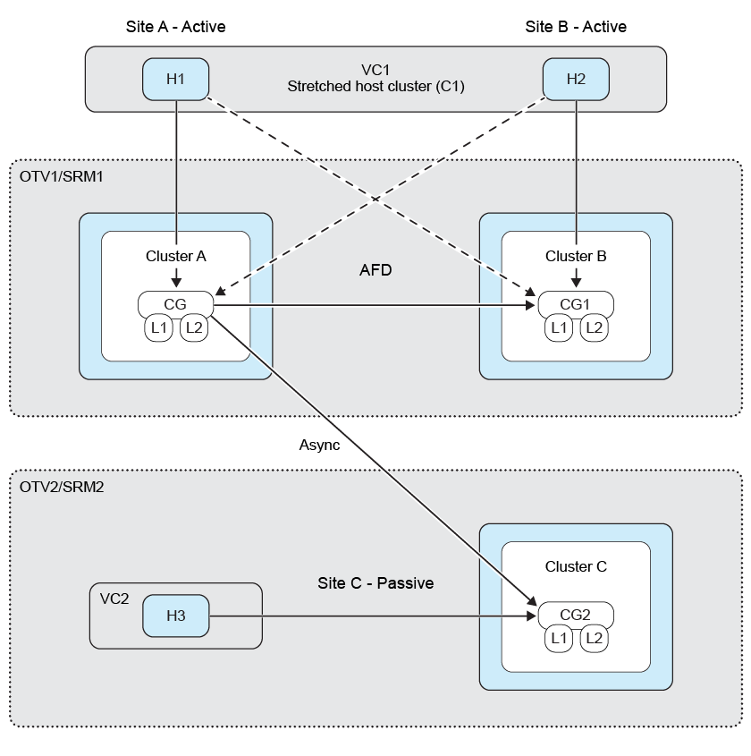

= 팬 아웃 보호
:allow-uri-read: 
:icons: font
:imagesdir: ../media/

[role="lead"]
팬 아웃 보호에서는 일관성 그룹이 첫 번째 대상 ONTAP 클러스터에서 동기식 관계와 두 번째 대상 ONTAP 클러스터에서의 비동기식 관계를 통해 이중 보호됩니다. SnapMirror 액티브 동기화 보호 워크플로우를 생성, 편집 및 삭제하면 동기식 보호 기능이 유지됩니다. SRM 페일오버 및 재보호 워크플로는 비동기 보호를 유지합니다.

팬 아웃 보호를 설정하려면 3개의 사이트 클러스터와 SVM을 피어링해야 합니다.

예:

|===

| If(경우 | 그런 다음 

 a| 
* 소스 정합성 보장 그룹이 클러스터 C1 및 SVM svm1에 있습니다
* 첫 번째 대상 정합성 보장 그룹은 클러스터 C2 및 SVM svm2 및 에 있습니다
* 두 번째 대상 정합성 보장 그룹이 클러스터 C3 및 SVM svm3에 있습니다

 a| 
* 소스 ONTAP 클러스터의 클러스터 피어링은 (C1, C2) 및 (C1, C3)입니다.
* 첫 번째 대상 ONTAP 클러스터의 클러스터 피어링은 (C2, C1) 및 (C2, C3) 등입니다
* 두 번째 대상 ONTAP 클러스터의 클러스터 피어링은 (C3, C1) 및 (C3, C2)입니다.
* 소스 SVM에서 SVM 피어링은 (svm1, svm2) 및 (svm1, svm3)입니다.
* 첫 번째 대상 SVM에서 SVM 피어링은 (svm2, svm1) 및 (svm2, svm3) 및 입니다
* 두 번째 목적지 svm의 SVM 피어링은 (svm3, svm1) 및 (svm3, svm2)입니다.

|===
다음 다이어그램은 팬 아웃 보호 구성을 보여 줍니다.  image:../media/fan-out-protection-relationship.png["팬 아웃 보호 관계"]

* 단계 *

. 새로운 플레이스홀더 데이터 저장소를 만듭니다. 나타내다 https://techdocs.broadcom.com/us/en/vmware-cis/live-recovery/site-recovery-manager/8-8/site-recovery-manager-administration-8-8/about-placeholder-virtual-machines/configure-a-placeholder-datastore.html["자리 표시자 데이터 저장소를 선택합니다"]
. 호스트 클러스터 보호에 데이터 link:../manage/edit-hostcluster-protection.html["보호된 호스트 클러스터를 수정합니다"]저장소를 추가합니다. 비동기 및 동기 정책 유형을 모두 추가해야 합니다.

